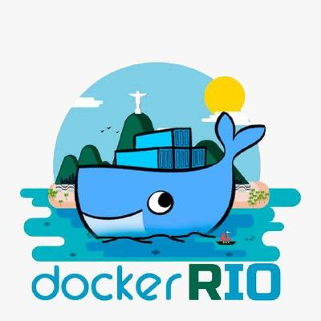

# Capture The Flag 2022 - Docker Rio 


## Desafio
1. Em uma parte do codigo em React existe **Replace Here!!!** substitua pelo seu **Nome Completo**.
2. Criar o **Dockerfile** usando **multi-stage build**
3. Enviar a imagem para um **registry**, preferenciamente DockerHub
4. Criar 2 Networks
4.1. **Network Front End** temos acesso a porta do container  externamente
4.2.**Network do DB** teremos acesso somente pelo container de FrontEnd ou da Network de DB, sem acesso externo ao banco
5. Subir o container da Aplicação e do Banco usando **Docker Compose** ou **Docker Swarm**

## Referencias
```
https://blog.codeexpertslearning.com.br/dockerizando-uma-aplica%C3%A7%C3%A3o-react-js-f6a22e93bc5d
https://docs.docker.com/engine/reference/commandline/build/
https://docs.docker.com/compose/
https://docs.docker.com/engine/reference/commandline/push/https://docs.docker.com/compose/networking/
https://docs.docker.com/engine/swarm/
https://www.docker.com/101-tutorial/
